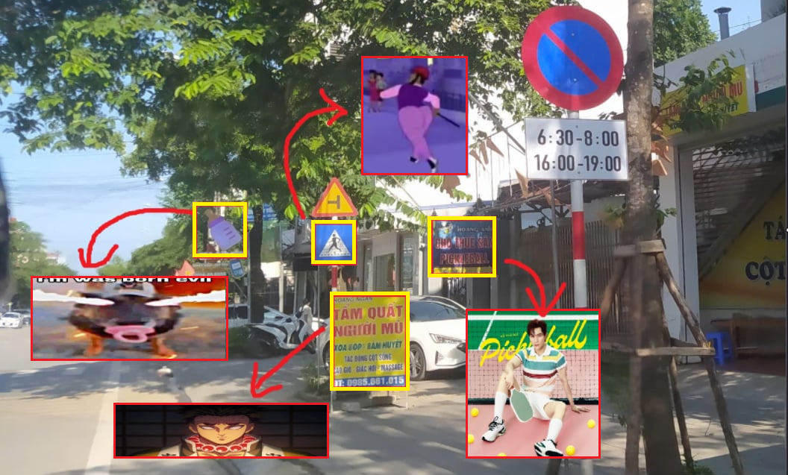

<h1 align="center">Vietnam Traffic Sign Detection</h1>
<h3 align="center">Our first Machine Learning, Deep Learning, and Computer Vision Project</h3>

<div align="center">
  <a href="https://hoanbucon.id.vn" target="_blank">
    
  </a>
</div>

<hr>

<!-- LƯU Ý: Nếu có &#x26; thì phải sửa thành & -->
<h3>Contributors:</h3>
<ul>
  <li><a href="https://github.com/davidislearninghowtocode" target="_blank">🧠 <b>David Vu</b></a></li>
  <li><a href="https://github.com/AnDpTri" target="_blank">💻 <b>The Peak</b></a></li>
  <li><a href="https://github.com/HoanBuCon" target="_blank">💻 <b>Hoàn Bự Con</b></a></li>
</ul>

<hr>

<h3>About the Project:</h3>  

- **Dataset:** <a href="https://www.kaggle.com/datasets/maitam/vietnamese-traffic-signs" target="_blank">Vietnam Traffic Signs</a>

- The model is based on YOLOv8-medium architecture

- This project is designed with strong potential for future development and improvement.

- This shit is so peak

<hr>

<h3 align="left">Languages and Tools:</h3>
<p align="left">
  <a href="https://www.python.org" target="_blank" rel="noreferrer">  </a>
  <a href="https://www.ultralytics.com/brand">  </a>
  <a href="https://pytorch.org/" target="_blank" rel="noreferrer">  </a>
  <a href="https://git-scm.com/" target="_blank" rel="noreferrer">  </a>
</p>

<hr>

<h3>Installation guide:</h3>

### 📁 Project Structure

```plaintext
Traffic-Sign-Detection/
│
├── src/
│   ├── core/
│   │   └── utils.py
│   │
│   ├── training/
│   │   ├── train.py
│   │   └── config.py
│   │
│   ├── weight/
│   │   └── all_weight/
│   │       ├── trainX
│   │       │   ├── best.pt
│   │       │   └── last.pt
│   │       │
│   │       └── yolov8m.pt
│   │
│   ├── pipeline/
│   │   ├── predict.py
│   │   ├── real_time_predict.py
│   │   ├── real_time_predict_smooth_advanced.py
│   │   └── real_time_predict_nlp_hybrid.py
│   │
│   └── sort.py
│
├── data/
│   ├── dataset/
│   ├── input/
│   ├── output/
│   └── real_time_output/
│
├── assets/
├── runs/
├── .env
├── requirements.txt
└── README.md
```

### 1️⃣ Clone the repository

```bash
git clone https://github.com/HoanBuCon/Traffic-Sign-Detection
cd Traffic-Sign-Detection
```

### 2️⃣ (Optional) Create a virtual environment
```bash
python -m venv venv
# Activate virtual environment
source venv/bin/activate       # Linux/macOS
venv\Scripts\activate          # Windows
```

### 3️⃣ Install dependencies
```bash
pip install -r requirements.txt
```

### 4️⃣ Prepare dataset and config
- Dataset layout (YOLO format):
  - Images: `dataset/images/train`, `dataset/images/val`, `dataset/images/test`
  - Labels: `dataset/labels/train`, `dataset/labels/val`, `dataset/labels/test`
- If your images/labels are flat under `dataset/`, split into train/val:
  ```bash
  # From repo root
  python -m src.split_dataset
  ```
- Dataset YAML (auto-detected):
  - Preferred: `data/dataset/data.yaml` (current setup)
  - Fallbacks: `data/data.yaml`, then repo-root `data.yaml`
  - Override via env var:
  ```powershell
  $env:DATA_YAML = "data/dataset/data.yaml"
  ```
- Folders are auto-created at runtime; no manual setup needed:
  - `input/` (for your images), `output/` (predictions under `output/predictX/{images,json}`),
    `real_time_output/` (saved videos), `all_weight/` (trained weights organized as `trainX/`).
- Place any test images you want to run in `input/`.

### 5️⃣ Training
- Ensure you have a valid dataset YAML. The project auto-detects in this order: `data/dataset/data.yaml` or `.yml`, then `data/data.yaml` or `.yml`, then repo root. You can override with env var `DATA_YAML`.
- Open ***Terminal*** and run this script from the repo root using module mode:
```bash
python -m src.training.train
```

### 6️⃣ Detect traffic signs
#### Option 1: Detect with images
- Place the traffic signs images you want to detect into the 📁`input` folder: ```.\Traffic-Sign-Detection\data\input```
- Open ***Terminal*** and run the detection script from the repo root:
```bash
python -m src.pipeline.predict
```
#### Option 2: Detect with real time webcam/camera
- Open ***Terminal*** and run the script for basic real-time detection:
```bash
python -m src.pipeline.real_time_predict
```

#### Option 3: Detect with real time webcam with advanced smooth
- Make sure you have placed `sort.py` in the `src` directory.
- Open ***Terminal*** and run the script for advanced real-time detection with SORT:
```bash
python -m src.pipeline.real_time_predict_smooth_advanced
```

#### Option 4: Real-Time Detection with Vintern NLP Hybrid Model

This option enables **real-time traffic sign detection** combined with **NLP-based semantic analysis** using the Vintern model hosted on **Hugging Face**.

##### ⚙️ Setup Instructions
1. **Create a `.env` file** in the project’s root directory.  
2. Go to [**Hugging Face Tokens**](https://huggingface.co/settings/tokens) and **generate a new Access Token**.  
3. Add your token to the `.env` file as follows:
   ```env
   HF_TOKEN=your_huggingface_token_here
   ```
Open ***Terminal*** and run the script for advanced real-time detection with NLP Model:
```bash
python -m src.pipeline.real_time_predict_nlp_hybrid
```

### 7️⃣ Data

- Detected images: ```.\Traffic-Sign-Detection\data\output```
- Detected videos: ```.\Traffic-Sign-Detection\data\real_time_output```
- Trained weights: ```.\Traffic-Sign-Detection\weight\all_weight```

### 8️⃣ Enjoy🎉
- Thank you for checking out our project! Feel free to explore, improve, or contribute 🚀

<hr>

### 9️⃣ Connect with us
<p align="left">
<a href="https://discord.gg/https://discord.gg/nckzdQE73u" target="_blank"></a>
</p>

<hr>

### 📌 Documents

<table>
  <tr>
    <td width="40" align="center">
      
    </td>
    <td>
      <a href="https://github.com/HoanBuCon/Traffic-Sign-Detection/blob/master/assets/GROUP_14_SIC_AI_Capstone_Project_Final_Report.pdf">
        <b>Project Report (PDF)</b>
      </a>
    </td>
  </tr>
  <tr>
    <td align="center">
      
    </td>
    <td>
      <a href="https://github.com/HoanBuCon/Traffic-Sign-Detection/blob/master/assets/GROUP_14_SIC_AI_Capstone_Project_Final_Report.docx">
        <b>Project Report (Word)</b>
      </a>
    </td>
  </tr>
  <tr>
    <td align="center">
      
    </td>
    <td>
      <a href="https://github.com/HoanBuCon/Traffic-Sign-Detection/blob/master/assets/GROUP_14_SIC_AI_Capstone_Project_Final_Report.pptx">
        <b>Project Presentation (PPTX)</b>
      </a>
    </td>
  </tr>
</table>